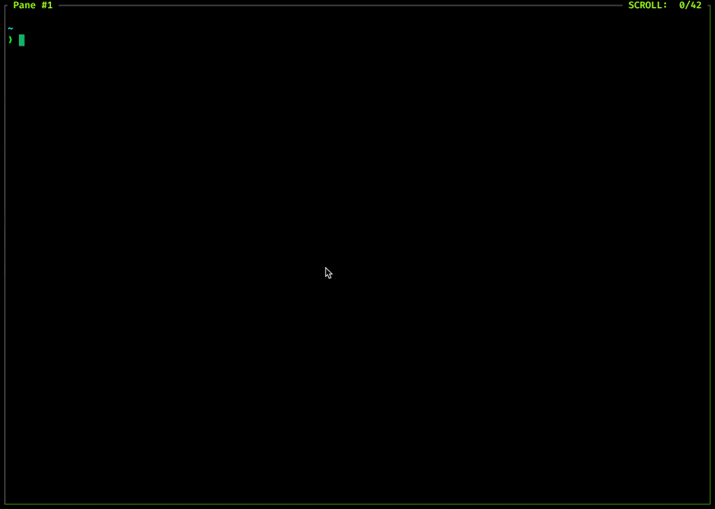

# Adam Go Kit

This is a took to generate skeleton applications using my Go kit. It makes use of the following:

* [Go 1.25](https://golang.org)
* [Adam's Go Kit](https://github.com/adampresley/adamgokit) v1.20.0
* [Pico CSS](https://picocss.com) v2.0.6
* [HTMX](https://htmx.org) v2.0.4

## Install

To install this tool, ensure you have Go v1.23+ and run the following:

```bash
go install github.com/adampresley/adamgokit/cmd/adamgokit@v1.19.2
```

## 🚀 Usage

This application is a project generator TUI. Simply run it and answer the questions.

```bash
adamgokit
```


